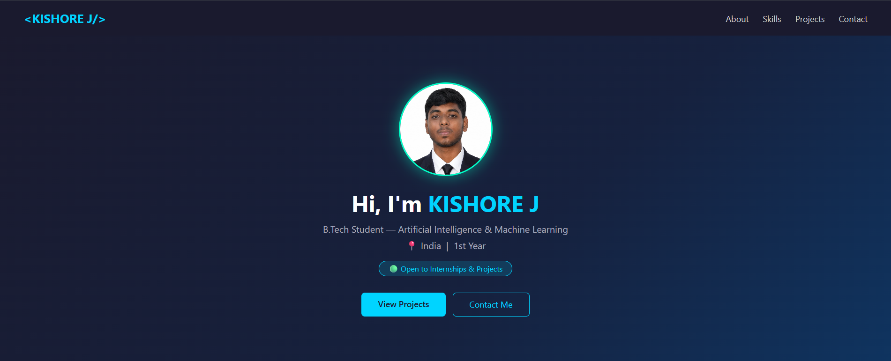
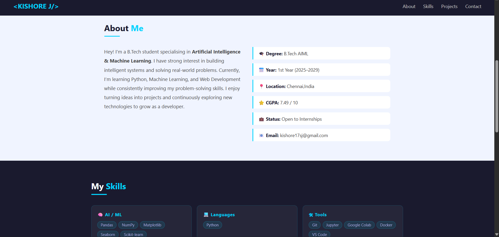
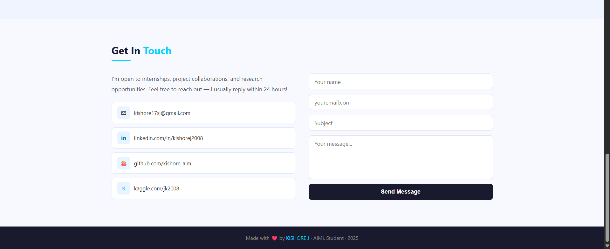

# Ex01 Portfolio
## Date:

## AIM
To create a Portfolio using HTML and CSS.

## ALGORITHM
### STEP 1
Create an HTML file (index.html)

### STEP 2
Create a CSS file (style.css)

### STEP 3
Include a navigation bar with links to different sections.

### STEP 4
Add structured sections for introduction, about, projects, and contact details.

### STEP 5
Define global styles for fonts, colors, and layout.

### STEP 6
Style the header, navigation bar, and sections.

### STEP 7
Use Flexbox or CSS Grid for layout design.

### STEP 8
Add hover effects and transitions for interactivity.

### STEP 9
Add Images and Media.

### STEP 10
Use optimized images for a professional look.

### STEP 11
Open the HTML file in a browser to check layout and functionality.

### STEP 12
Fix styling issues and refine content placement.

### STEP 13
Deploy the Portfolio.

### STEP 14
Upload to GitHub Pages for free hosting.

## PROGRAM
```
##html

<!DOCTYPE html>
<html lang="en">
<head>
  <meta charset="UTF-8" />
  <meta name="viewport" content="width=device-width, initial-scale=1.0"/>
  <title>My Portfolio</title>
  <style>
    * { margin: 0; padding: 0; box-sizing: border-box; }

    body {
      font-family: 'Segoe UI', sans-serif;
      background: #f0f4ff;
      color: #222;
    }

    /* ── NAV ── */
    nav {
      background: #1a1a2e;
      padding: 16px 40px;
      display: flex;
      justify-content: space-between;
      align-items: center;
      position: sticky;
      top: 0;
      z-index: 100;
    }
    nav .logo {
      color: #00d4ff;
      font-size: 1.3rem;
      font-weight: 700;
    }
    nav ul {
      list-style: none;
      display: flex;
      gap: 24px;
    }
    nav ul a {
      color: #ccc;
      text-decoration: none;
      font-size: 0.9rem;
      transition: color 0.2s;
    }
    nav ul a:hover { color: #00d4ff; }

    /* ── HERO ── */
    .hero {
      background: linear-gradient(135deg, #1a1a2e 0%, #16213e 60%, #0f3460 100%);
      color: white;
      text-align: center;
      padding: 80px 20px;
    }
    .hero .avatar {
      width: 100px;
      height: 100px;
      border-radius: 50%;
      background: #00d4ff;
      color: #1a1a2e;
      font-size: 2.5rem;
      font-weight: 700;
      display: flex;
      align-items: center;
      justify-content: center;
      margin: 0 auto 20px;
    }
    .hero h1 { font-size: 2.4rem; margin-bottom: 8px; }
    .hero h1 span { color: #00d4ff; }
    .hero p { color: #aab; font-size: 1rem; margin-bottom: 6px; }
    .hero .badge {
      display: inline-block;
      background: rgba(0,212,255,0.15);
      border: 1px solid #00d4ff;
      color: #00d4ff;
      padding: 4px 16px;
      border-radius: 20px;
      font-size: 0.8rem;
      margin-top: 10px;
    }
    .hero-btns { margin-top: 28px; display: flex; gap: 12px; justify-content: center; }
    .btn-blue {
      background: #00d4ff;
      color: #1a1a2e;
      padding: 10px 28px;
      border-radius: 6px;
      text-decoration: none;
      font-weight: 600;
      font-size: 0.9rem;
      transition: opacity 0.2s;
    }
    .btn-blue:hover { opacity: 0.85; }
    .btn-outline {
      border: 1.5px solid #00d4ff;
      color: #00d4ff;
      padding: 10px 28px;
      border-radius: 6px;
      text-decoration: none;
      font-size: 0.9rem;
      transition: background 0.2s;
    }
    .btn-outline:hover { background: rgba(0,212,255,0.1); }

    /* ── SECTIONS ── */
    section { padding: 60px 40px; max-width: 960px; margin: 0 auto; }
    h2.sec-title {
      font-size: 1.6rem;
      color: #1a1a2e;
      margin-bottom: 8px;
    }
    h2.sec-title span { color: #00d4ff; }
    .divider {
      width: 48px; height: 3px;
      background: #00d4ff;
      border-radius: 2px;
      margin-bottom: 32px;
    }

    /* ── ABOUT ── */
    .about-grid {
      display: grid;
      grid-template-columns: 1fr 1fr;
      gap: 32px;
      align-items: start;
    }
    .about-grid p {
      font-size: 0.95rem;
      line-height: 1.85;
      color: #444;
    }
    .info-list { list-style: none; display: flex; flex-direction: column; gap: 12px; }
    .info-list li {
      background: white;
      border-left: 3px solid #00d4ff;
      padding: 10px 16px;
      border-radius: 0 8px 8px 0;
      font-size: 0.88rem;
      color: #333;
    }
    .info-list li strong { color: #1a1a2e; }

    .profile-pic {
  width: 160px;
  height: 160px;
  border-radius: 50%;
  object-fit: cover;
  display: block;
  margin: 0 auto 20px; /* center + space below */
  border: 3px solid #00ffc8;
  box-shadow: 0 0 25px rgba(0, 255, 200, 0.5);
}


    /* ── SKILLS ── */
    #skills { background: #1a1a2e; max-width: 100%; padding: 60px 40px; }
    #skills .inner { max-width: 960px; margin: 0 auto; }
    #skills h2.sec-title { color: white; }
    .skills-grid {
      display: grid;
      grid-template-columns: repeat(auto-fit, minmax(200px, 1fr));
      gap: 16px;
    }
    .skill-box {
      background: rgba(255,255,255,0.05);
      border: 1px solid rgba(0,212,255,0.2);
      border-radius: 10px;
      padding: 18px;
    }
    .skill-box h4 {
      color: #00d4ff;
      font-size: 0.85rem;
      margin-bottom: 12px;
      letter-spacing: 0.05em;
    }
    .tags { display: flex; flex-wrap: wrap; gap: 6px; }
    .tag {
      background: rgba(0,212,255,0.1);
      color: #aad;
      border: 1px solid rgba(0,212,255,0.25);
      padding: 3px 10px;
      border-radius: 20px;
      font-size: 0.75rem;
    }

    /* ── PROJECTS ── */
    .projects-grid {
      display: grid;
      grid-template-columns: repeat(auto-fit, minmax(260px, 1fr));
      gap: 20px;
    }
    .card {
      background: white;
      border-radius: 12px;
      padding: 22px;
      box-shadow: 0 2px 12px rgba(0,0,0,0.07);
      border-top: 3px solid #00d4ff;
      transition: transform 0.2s, box-shadow 0.2s;
    }
    .card:hover { transform: translateY(-4px); box-shadow: 0 8px 24px rgba(0,0,0,0.12); }
    .card-label {
      font-size: 0.7rem;
      text-transform: uppercase;
      letter-spacing: 0.1em;
      color: #00d4ff;
      margin-bottom: 8px;
    }
    .card h3 { font-size: 1rem; color: #1a1a2e; margin-bottom: 8px; }
    .card p { font-size: 0.82rem; color: #666; line-height: 1.7; margin-bottom: 14px; }
    .card .tech { display: flex; flex-wrap: wrap; gap: 5px; }
    .card .tech span {
      background: #f0f4ff;
      color: #1a1a2e;
      font-size: 0.7rem;
      padding: 2px 8px;
      border-radius: 4px;
    }

    /* ── CONTACT ── */
    #contact { background: #f8f9ff; max-width: 100%; padding: 60px 40px; }
    #contact .inner { max-width: 960px; margin: 0 auto; }
    .contact-grid {
      display: grid;
      grid-template-columns: 1fr 1fr;
      gap: 32px;
    }
    .contact-info p { font-size: 0.9rem; color: #555; line-height: 1.8; margin-bottom: 20px; }
    .link-item {
      display: flex;
      align-items: center;
      gap: 10px;
      padding: 10px 14px;
      background: white;
      border-radius: 8px;
      border: 1px solid #e0e8ff;
      text-decoration: none;
      color: #333;
      font-size: 0.85rem;
      margin-bottom: 10px;
      transition: border-color 0.2s;
    }
    .link-item:hover { border-color: #00d4ff; color: #1a1a2e; }
    .link-item .icon {
      width: 32px; height: 32px;
      background: #e8f4ff;
      border-radius: 6px;
      display: flex; align-items: center; justify-content: center;
      font-size: 0.9rem; flex-shrink: 0;
    }
    .form { display: flex; flex-direction: column; gap: 12px; }
    .form input, .form textarea {
      padding: 10px 14px;
      border: 1px solid #dde;
      border-radius: 8px;
      font-family: 'Segoe UI', sans-serif;
      font-size: 0.88rem;
      outline: none;
      transition: border-color 0.2s;
      background: white;
    }
    .form input:focus, .form textarea:focus { border-color: #00d4ff; }
    .form textarea { height: 110px; resize: none; }
    .form button {
      background: #1a1a2e;
      color: white;
      border: none;
      padding: 12px;
      border-radius: 8px;
      font-size: 0.9rem;
      font-weight: 600;
      cursor: pointer;
      transition: background 0.2s;
    }
    .form button:hover { background: #0f3460; }

    /* ── FOOTER ── */
    footer {
      background: #1a1a2e;
      color: #888;
      text-align: center;
      padding: 20px;
      font-size: 0.8rem;
    }
    footer span { color: #00d4ff; }

    /* ── RESPONSIVE ── */
    @media (max-width: 640px) {
      nav { padding: 12px 20px; }
      nav ul { gap: 14px; }
      .hero { padding: 60px 20px; }
      .hero h1 { font-size: 1.8rem; }
      section { padding: 40px 20px; }
      .about-grid, .contact-grid { grid-template-columns: 1fr; }
      #skills, #contact { padding: 40px 20px; }
    }
  </style>
</head>
<body>

<!-- NAV -->
<nav>
  <div class="logo">&#60;KISHORE J/&#62;</div>
  <ul>
    <li><a href="#about">About</a></li>
    <li><a href="#skills">Skills</a></li>
    <li><a href="#projects">Projects</a></li>
    <li><a href="#contact">Contact</a></li>
  </ul>
</nav>

<!-- HERO -->
<div class="hero">
  
  <h1>Hi, I'm <span>KISHORE J</span></h1>
  <p>B.Tech Student — Artificial Intelligence &amp; Machine Learning</p>
  <p>📍 India &nbsp;|&nbsp; 1st Year</p>
  <div class="badge">🟢 Open to Internships &amp; Projects</div>
  <div class="hero-btns">
    <a href="#projects" class="btn-blue">View Projects</a>
    <a href="#contact" class="btn-outline">Contact Me</a>
  </div>
</div>

<!-- ABOUT -->
<section id="about">
  <h2 class="sec-title">About <span>Me</span></h2>
  <div class="divider"></div>
  <div class="about-grid">
    <p>
      Hey! I'm a B.Tech student specialising in <strong>Artificial Intelligence &amp;
      Machine Learning</strong>. I have strong interest in building intelligent systems and solving real-world problems. 
Currently, I’m learning Python, Machine Learning, and Web Development while consistently improving my problem-solving skills. 

I enjoy turning ideas into projects and continuously exploring new technologies to grow as a developer.
    </p>
    <ul class="info-list">
      <li><strong>🎓 Degree:</strong> B.Tech AIML</li>
      <li><strong>📅 Year:</strong> 1st Year (2025–2029)</li>
      <li><strong>📍 Location:</strong> Chennai,India</li>
      <li><strong>⭐ CGPA:</strong> 7.49 / 10</li>
      <li><strong>💼 Status:</strong> Open to Internships</li>
      <li><strong>📧 Email:</strong> kishore17sj@gmail.com</li>
    </ul>
  </div>
</section>

<!-- SKILLS -->
<div id="skills">
  <div class="inner">
    <h2 class="sec-title">My <span>Skills</span></h2>
    <div class="divider"></div>
    <div class="skills-grid">

      <div class="skill-box">
        <h4>🧠 AI / ML</h4>
        <div class="tags">
          <span class="tag">Pandas</span>
          <span class="tag">NumPy</span>
          <span class="tag">Matplotlib</span>
          <span class="tag">Seaborn</span>
          <span class="tag">Scikit-learn</span>
        </div>
      </div>

      <div class="skill-box">
        <h4>💻 Languages</h4>
        <div class="tags">
          <span class="tag">Python</span>
        </div>
      </div>

      <div class="skill-box">
        <h4>🛠 Tools</h4>
        <div class="tags">
          <span class="tag">Git</span>
          <span class="tag">Jupyter</span>
          <span class="tag">Google Colab</span>
          <span class="tag">Docker</span>
          <span class="tag">VS Code</span>
        </div>
      </div>

    </div>
  </div>
</div>

<!-- PROJECTS -->
<section id="projects">
  <h2 class="sec-title">My <span>Projects</span></h2>
  <div class="divider"></div>
  <div class="projects-grid">

    <div class="card">
      <div class="card-label">Gen AI</div>
      <h3>AI Study Chatbot</h3>
      <p>RAG-based chatbot that answers questions from uploaded PDFs using LangChain and FAISS vector search.</p>
      <div class="tech">
        <span>LangChain</span><span>RAG</span><span>FAISS</span><span>Gemini</span>
      </div>
    </div>

  </div>
</section>

<!-- CONTACT -->
<div id="contact">
  <div class="inner">
    <h2 class="sec-title">Get In <span>Touch</span></h2>
    <div class="divider"></div>
    <div class="contact-grid">

      <div class="contact-info">
        <p>I'm open to internships, project collaborations, and research opportunities.
        Feel free to reach out — I usually reply within 24 hours!</p>
        <a href="mailto:your@email.com" class="link-item">
          <div class="icon">✉</div> kishore17sj@gmail.com
        </a>
        <a href="www.linkedin.com/in/kishorej2008" target="_blank" class="link-item">
          <div class="icon" style="font-weight:700;color:#0077b5;">in</div>
          linkedin.com/in/kishorej2008
        </a>
        <a href="https://github.com/kishore-aiml" target="_blank" class="link-item">
          <div class="icon">🐙</div> github.com/kishore-aiml
        </a>
        <a href="https://www.kaggle.com/jk2008" target="_blank" class="link-item">
          <div class="icon" style="font-weight:700;font-size:0.75rem;color:#20beff;">K</div>
          kaggle.com/jk2008
        </a>
      </div>

      <div class="form">
        <input type="text"  placeholder="Your name" />
        <input type="email" placeholder="youremail.com" />
        <input type="text"  placeholder="Subject" />
        <textarea           placeholder="Your message..."></textarea>
        <button onclick="alert('Thanks! Connect this to Formspree for real emails 🚀')">
          Send Message
        </button>
      </div>

    </div>
  </div>
</div>

<!-- FOOTER -->
<footer>
  <p>Made with ❤️ by <span>KISHORE J</span> · AIML Student · 2025</p>
</footer>

</body>
</html>
```


## OUTPUT




## RESULT
The program for creating Portfolio using HTML and CSS is executed successfully.
